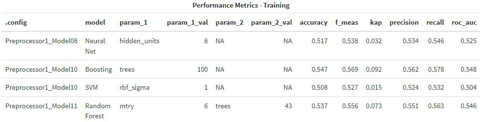
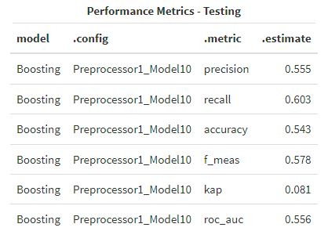

# Overview

This report leverages various machine learning models (decision trees, random forests, neural nets, and support vector machines) to predict up/down movements in the S&P500.
The explanatory variables used for predictions are limited to daily trading volume as well as simple market returns over the past 5 trading days.
The data used in this report was sourced from the ISLR package in R and contains daily market observations from 2001-2005.

The full version of this report can be downloaded by clicking [here](https://github.com/RobAranha/marketMover/raw/main/marketMover.zip).  

## Performance Metrics (Training)

Performance metrics for each of our top model configurations are shown below.

## Performance Metrics (Testing)

Overall, our boosted decision tree was shown to be the most optimal model for predicting up/down movements in the S&P500. This model achieved an accuracy score of 54.3% and AUC score of 0.556 on our testing dataset.

Performance metrics for this model are shown below.

